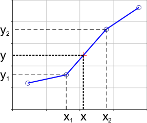
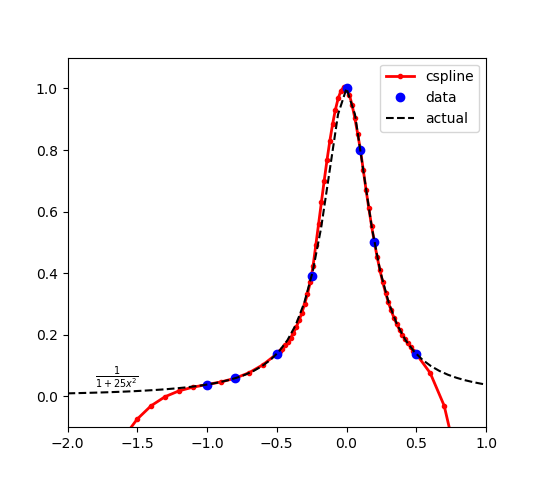
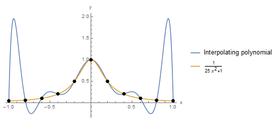
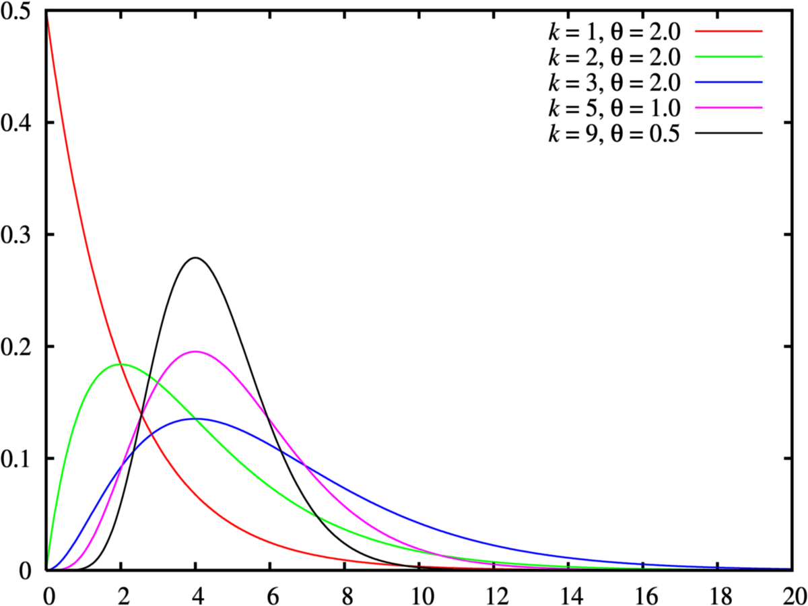

# Machine Learning Essential Concepts

## Model Calibration

- A calibrated model produces calibrated probabilities which means a prediction of a class with confidence p is correct 100*p percent of the time.
 It is important to know which percentage of samples that model predicted to be positive (with p probability) are actually positive in the dataset. With a well calibrated model, we expect that p of the samples that got a predicted probability of around p to be positive. Model calibration measures how well the model prediction is aligned with true distribution of the data. [More here ...](https://wttech.blog/blog/2021/a-guide-to-model-calibration/).

    

## Model Overfitting vs Underfitting

 - Overfitting occurs when a model is too complex and fits the training data too closely. This leads to poor generalization.
Underfitting occurs when a machine learning model is too simple leading to low model accuracy and poor performance. [More here ...](https://databasecamp.de/en/ml/underfitting-en)

 - How to resolve overfitting:
   - Adding more data samples
   - Adding noise to the data
   - Data augmentation
   - Feature selection
   - Cross Validation
   - Model regularization (loss, or adding dropouts)
   
   
 - How to resolve underfitting:
   - Add more features (e.g. feature engineering)
   - Increase model complexity
   - Data denoising
   - Running more training epochs 
 
 
 
 

## Data Drift vs Concept Drift

- Data drift is the changes over time in the statistical properties of the input data. It occurs in production  as the new incoming data deviates from the original data the model was trained on or earlier production data. This shift in input data distribution can lead to a decline in the model's performance and must be detected. Concept drift relates to changes occurring over time in the relationships between input and target variables. It can cause a decay in the model quality and lead to a poor estimation on target values. [More here ...](https://www.evidentlyai.com/ml-in-production/data-drift) 

   
    

## Gradient Exploding vs Gradient Vanishing

 - Gradient vanishing occurs when model's weights become extremely small (close to zero) as they are backpropagated through the layers of neural networks. It means the model's weights are not updated effectively and cannot learn the complex pattern in the data. How to resolve gradient vanishing
 
   - Apply different activation functions (e.g. tanh, Sigmoid, ReLU, Maxout,  ELU, SoftPlus, softsign, seLU)
   - Try different weight initialization (Xavier or He initializer)
   - Replace different optimizer (Adam, SGD, RMSprop, AdamW, Adadelta)
   - Tune learning rate from `1-e5` to `0.1` 
 
 
 - Gradient exploding  occurs when the loss value grows exponentially during training. It cause the large update to the weights and weights become NaN or infinity. How to resolve gradient exploding
 
   - Use batch normalization
   - Decrease number of layers in the model
   - Try different weight initialization
   - Apply gradient clipping which restricts weights in a certain range 
   - [More here ...](https://aiml.com/what-do-you-mean-by-vanishing-and-exploding-gradient-problem-and-how-are-they-typically-addressed/)
 
    

## Momentum in Neural Networks

- During training, gradient descent does not exactly provide the direction in which the loss function is headed i.e. the derivative of the loss function. Therefore, the loss value might not always be headed in the optimal direction and can easily gets stuck in a local minima. To avoid this situation, we use a momentum term in the objective function, which is a value between `0` and `1` that increases the size of the steps taken towards the minimum by trying to jump from a local minima. If the momentum term is large then the learning rate should be kept smaller. A large value of momentum also means that the convergence will happen fast. But if both the momentum and learning rate are kept at large values, then you might skip the minimum with a huge step. A small value of momentum cannot reliably avoid local minima, and can also slow down the training of the system. Momentum also helps in smoothing out the variations, if the gradient keeps changing direction. A right value of momentum can be either learned by hit and trial or through cross-validation. [More here](https://medium.com/analytics-vidhya/momentum-a-simple-yet-efficient-optimizing-technique-ef76834e4423)

   

## Xavier Initialization vs He Initialization

- Xavier/Glorot initialization is designed to alleviate the problem of vanishing or exploding gradients during training. With a random initialization, the model does not have any assumption about the data, therefore the weights can explode or vanish in a particular case. One good way is to assign the weights from a Gaussian distribution. Obviously this distribution would have zero mean and some finite variance. Let us consider a linear neuron:
 
$$
\begin{aligned}
 y = w_1 x_1 + w_2 x_2 + ... + w_n x_n + b
 \end{aligned}
$$

- With each passing layer, we want the variance to remain the same. This helps us keep the signal from exploding to a high value or vanishing to zero. In other words, we need to initialize the weights in such a way that the variance remains the same for $x$ and $y$. This initialization process is known as Xavier initialization. Let $fan_{in}$ denote the inputs for each neuron  and  $fan_{out}$ the output, Xavier normal tries to select the weights from normal distribution as 

$$
\begin{aligned}
 w_{ij} \sim \mathcal{N} ( 0 \, \sigma) 
\end{aligned}
$$

$$
\begin{aligned}
 \sigma= \sqrt{ \frac{2}{fan_{in}  + fan_{out} } } 
\end{aligned}
$$

 
- Xavier initialization is more effective for models with sigmoid activation function. [More here](https://prateekvjoshi.com/2016/03/29/understanding-xavier-initialization-in-deep-neural-networks/)

- He initialization is particularly suited for networks with ReLU activation functions. ReLU tends to zero out negative inputs, which can lead to a loss of variance in the network. To address this, normal He initialization sets the variance of the weights to be twice as large as Glorot Initialization as follows:

$$
\begin{aligned}
 w_{ij} \sim \mathcal{N} ( 0 \, \sigma) 
\end{aligned}
$$

$$
\begin{aligned}
 \sigma= \sqrt{ \frac{2}{fan_{in}} } 
\end{aligned}
$$

- In He initialization, the weights are initialized keeping in mind the size of the previous layer which helps in attaining a global minimum of the loss function faster and more efficiently. The weights are still random but differ in range depending on the size of the previous layer of neurons. This provides a controlled initialization hence the faster and more efficient gradient descent. [More here](https://prateekvishnu.medium.com/xavier-and-he-normal-he-et-al-initialization-8e3d7a087528)

## L1 vs L2 Regularization

 - `L1` regularization reduces overfitting in models by penalizing the absolute size of the model coefficients. 
The penalty term is the absolute value of the magnitudes of the coefficients, which reduces some coefficients to zero, removing the irrelevant features in a dataset. This encourages sparsity in the model and makes `L1` regularization very useful for feature selection in models with many variables. The penalty term added to the loss is the sum of the absolute values of the coefficients, multiplied by a regularization parameter $\lambda$.

$$
\begin{aligned}
 Loss+ \lambda \Sigma \| \beta_i|
\end{aligned}
$$

- `L2` regularization also  prevents overfitting by penalizing the size of the coefficients. Unlike `L1` regularization, which adds the absolute values of the coefficients to the loss function, `L2` regularization adds the square of the coefficients. This difference in approach leads to different characteristics and effects on the model. The `L2` regularization term is the sum of the squares of the coefficients, multiplied by a regularization parameter $\lambda$. [More here](https://wandb.ai/mostafaibrahim17/ml-articles/reports/Understanding-L1-and-L2-regularization-techniques-for-optimized-model-training--Vmlldzo3NzYwNTM5)

$$
\begin{aligned}
 Loss+ \lambda \Sigma \{\beta_i}^2
\end{aligned}
$$

## Model Hyperparameter  Optimization
 - Grid Search
 - Random Search
 - [Bayesian Search](http://minjeancho.com/bayesian_search/bayesian_search.html)
 
  

## Time Series Models

 - ARIMA
 - [BiLSTM](https://www.baeldung.com/cs/bidirectional-vs-unidirectional-lstm)
 
    
 
 - CNN-LSTM
 - Variational Autoencoder
 - Temporal Fusion Transformers 
 - Fourier Transform
 
 
## Dependent vs Independent Variables
 - The input variables are known as the independent variables, as each variable must describe a distinct aspect of the data which is not available in others.
 - The target variable is known as a dependent variable as the changes in input values will affect the target value.
 
     
 
 
## Data Interpolation

- Data interpolation is a technique  to estimate values between known data points in the dataset. It is widely used for filling missing data points or estimating values at points where data is not directly measured that can be helpfull im smoothing out irregularities in data, creating visualizations, or making predictions.
Data interpolate is effectively based on the nature of your data that can be linear, polynomial or spline.

      
      
 - Polynomial interpolation 
 
      
      
 - Spline interpolation 
 
      

## Data Augmentation

- soon ....

## SMOTE Oversampling

 - soon  ...
 
## Dimensionality Reduction

 - PCA
 - LDA
 - tSNE
 - UMAP

## plobplot and lmplot

- soon  ...

## Clustering
  - Spectral clustering
  - Hierarchical clustering

## Likelihood vs probability

- Probability refers to the chance of an event occurring, given a specific model or distribution. These events happen in one universe, therefore the sum of the probabilities must be `1`. For example, the probability of flipping a fair coin and getting heads is `0.5` and   getting tails is `0.5`. These two numbers add up to `1` as they exist in the same universe. 

- Likelihoods are the probability of the observed data under certain hypothetical scenarios.  Since there are many hypothetical scenarios there would be likelihoods that do not sum up to `1`.
For example,  given a dataset of coin flips, we can calculate the likelihood of different coin bias values (e.g., `0.4`, `0.5`, `0.6`) to determine the most likely value.

## Prior Probability vs Posterior Probability vs Likelihood

- soon  ...

## SVD vs Eigen Decomposition

- soon  ...

## Loss Functions

  - Hinge loss
  - KL loss
  - Cross entropy loss
  - Huber loss
 
 
## Boosting vs Bagging
 
 - soon  ...
 
## XGBoost vs Catboost
 - soon  ...
 
 
## High Bias vs High Variance
 - soon  ...
 
  
 
## Convex vs non-Convex Optimization Problem
 - soon  ...
 
## Statistical Concepts
 
 - Significance test
 - AB Testing
 - ANOVA
 - Information gain
 - Surprise value and Entropy value
 - Central Limit Theorem
 - Type I and Type II errors in hypothesis
 - Difference between descriptive and inferential statistics
 - Confidence interval
 - Bayes' Theorem
 - Difference between parametric and non-parametric tests
 - Difference between a z-score and a t-score
 - Simpson's paradox 
 - Q-Q plot
 - P–P plot
 - One-tailed and a two-tailed test
 - Odds ratio
 - Latent variables
 - Chi-square
 
 
## Distributions

  - **Bernoulli Distribution** is a discrete probability distribution that has two possible outcomes: success `1` or failure `0`. Here is the Probability Mass Function (PMF):
  
  
$$
\begin{aligned}
P(X=x) = p^x \times (1-p)^{(1-x)}
\end{aligned}
$$

  

   
  - Binomial Distribution
  
     
  
  - Multinomial Distribution
  
  - Poisson Distribution
  
    
    
  - Exponential Distribution
  
     
    
 -  Log-Normal Distribution   
 
    
  
  - Chi-squared Distribution
  
     
  

  - Gamma Distribution
  
     
  

  
 
 
 

